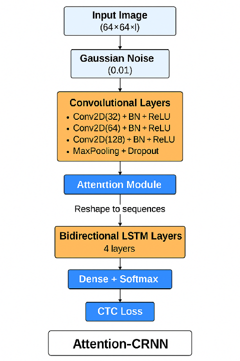

# CRNN模型在SVHN数据集上的应用

## 项目简介

本项目实现了一个卷积循环神经网络（Convolutional Recurrent Neural Network, CRNN）模型，用于识别街景门牌号码（Street View House Numbers, SVHN）数据集中的数字序列。CRNN模型结合了CNN的特征提取能力和RNN的序列处理能力，非常适合解决此类序列识别问题。

## 数据集介绍

SVHN数据集是一个真实世界中的图像数据集，包含了来自街景图像中的门牌号码。与MNIST等数字识别数据集不同，SVHN中的数字：

- 来自自然场景
- 具有不同的大小、朝向、颜色和字体
- 可能包含多个数字（1-5个数字不等）
- 有复杂的背景和噪声

数据集格式：每张图片对应一个标签，标签包含数字个数以及每个数字的标签。

## 模型架构

## 📋训练超参数表

| 超参数类别                  | 参数名                                  | 设置值       | 说明                             |
| --------------------------- | --------------------------------------- | ------------ | -------------------------------- |
| **学习率调度**        | 初始学习率 (`initial_learning_rate`)  | 0.001        | 训练初期的学习率起点             |
|                             | Warmup轮数 (`warmup_epochs`)          | 5            | 前5个epoch线性升高学习率         |
|                             | Cosine衰减周期 (`decay_epochs`)       | 20           | 余弦退火下降的总epoch数          |
| **Early Stopping**    | 监控指标 (`monitor`)                  | `val_loss` | 以验证集损失为监控对象           |
|                             | 耐心等待轮数 (`patience`)             | 3            | 验证集性能无改进时提前停止训练   |
|                             | 最小改善量 (`min_delta`)              | 1e-4         | 损失必须至少改善1e-4才能重置耐心 |
|                             | 恢复最佳权重 (`restore_best_weights`) | True         | 停止时回到验证集表现最好的权重   |
| **ReduceLROnPlateau** | 缩放因子 (`factor`)                   | 0.5          | 学习率降低为原来的一半           |
|                             | 耐心等待轮数 (`patience`)             | 2            | 验证集性能无改进时降低学习率     |
|                             | 最小改善量 (`min_delta`)              | 1e-4         | 损失改善低于1e-4认为无效         |
|                             | 最低学习率 (`min_lr`)                 | 1e-6         | 学习率不会降低到低于此值         |
| **训练过程**          | 总训练轮数 (`epochs`)                 | 40           | 最大训练轮数                     |
